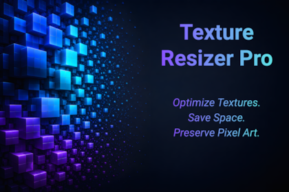

# PogromGames

**Development of software, utilities, tools and video games. Pixel art and audio design.**

---

## About

PogromGames is an independent development studio focused on delivering
professional-grade tools and content for the Unity ecosystem.
The studio combines technical precision with artistic attention to detail
to produce reliable software, efficient editor utilities, and immersive
game experiences.

Specializing in pixel art and audio design, PogromGames provides
complete creative solutions — from programming and visual assets to
sound — helping developers and studios accelerate their production and
achieve a polished result.

---

## Products

### Texture Resizer Pro

A powerful batch texture optimization tool for Unity.
Estimate file size and build savings before making changes,
preserve pixel-perfect sharpness with the dedicated Point filter,
and choose between safe import adjustments or permanent file resizing.

> Available on the Unity Asset Store.

---

## Contact

- **Email:** [support@pogromgames.com](mailto:support@pogromgames.com)
- **GitHub:** [github.com/PogromGames](https://github.com/PogromGames)
- **Unity Asset Store:** [Publisher Profile](https://assetstore.unity.com/publishers/...)

---

© 2025 PogromGames. All rights reserved.
